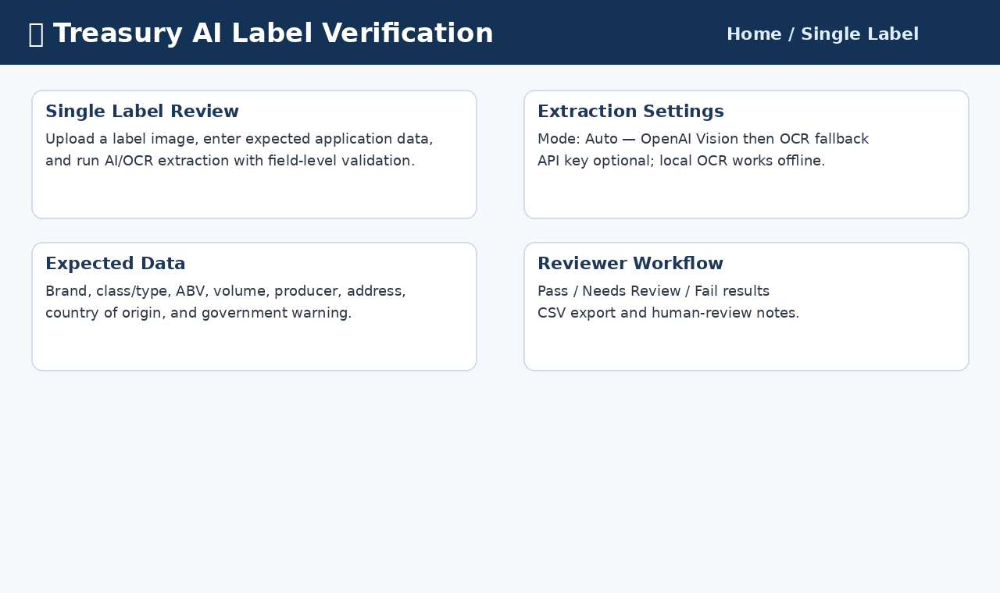
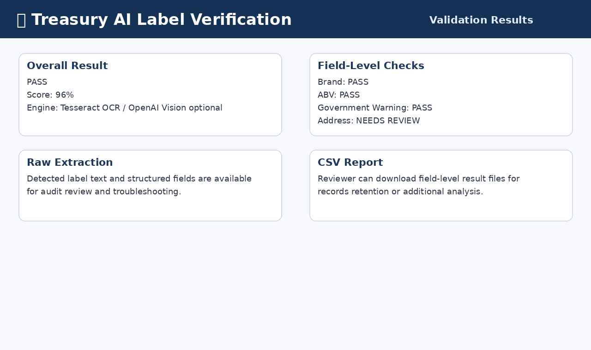
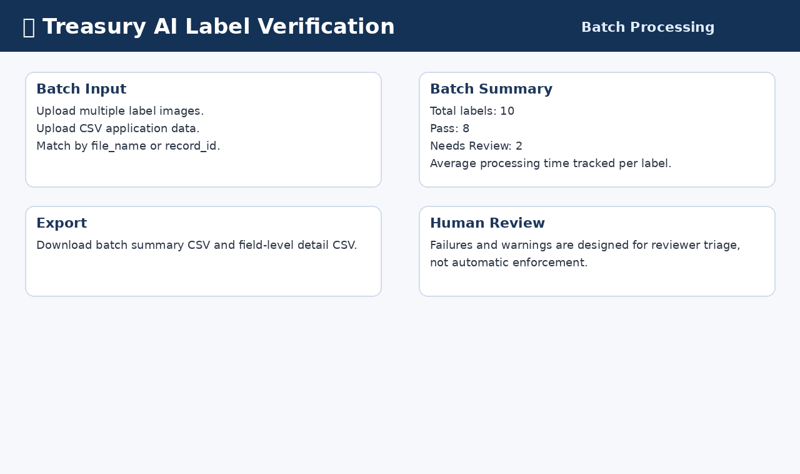
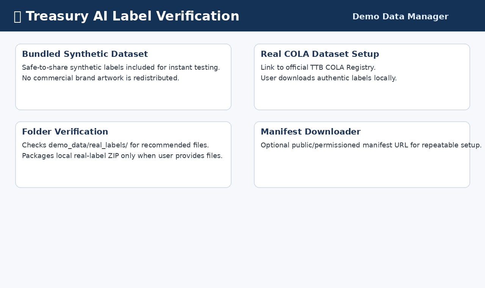
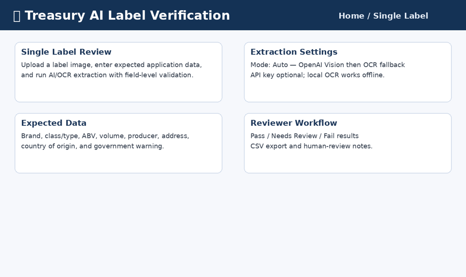
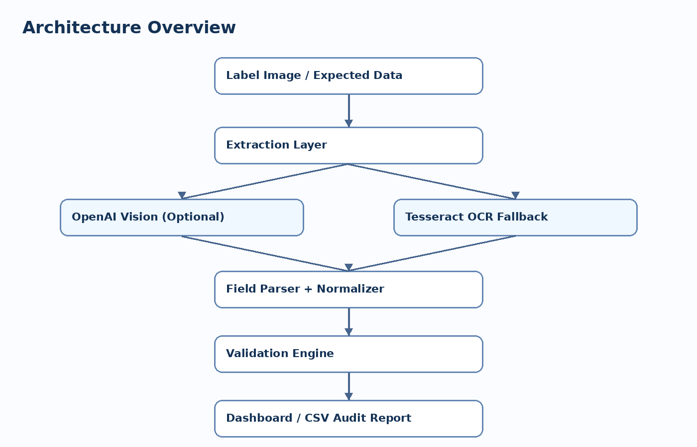

## Design Goals

This prototype was designed around five engineering principles:

- Reviewer-friendly deployment with a one-click Windows launcher.
- Offline capability through local Tesseract OCR.
- Optional AI enhancement using OpenAI Vision.
- Modular architecture supporting future regulatory rule expansion.
- Respect for copyright and trademark by excluding commercial label artwork from the repository.

- ## 🚀 Live Demo

**Application:**
https://treasury-ai-label-verifier-qepnbpjmfku7l2rpzmpldt.streamlit.app/

**Source Code:**
https://github.com/basharsaba/treasury-ai-label-verifier

# Treasury AI Label Verification Prototype

> AI-assisted alcohol label verification prototype developed for the U.S. Department of the Treasury AI Engineer take-home assessment.


---

## Original Take-Home Assignment

This application was developed in response to the official Treasury take-home assessment.

Original assignment: https://github.com/treasurytakehome-rgb/instructions

---

## 30-Second Quick Start

### Windows

Double-click or run:

```cmd
run.bat
```

The script creates a virtual environment if needed, installs dependencies, and starts Streamlit.

Open:

```text
http://localhost:8501
```

### macOS / Linux

```bash
chmod +x run.sh
./run.sh
```

### Docker

```bash
docker compose up --build
```

Open:

```text
http://localhost:8501
```

---

## Features

- Single-label review workflow
- Batch processing workflow
- Hybrid extraction engine
  - OpenAI Vision when configured
  - Local Tesseract OCR fallback
- Manual expected-data entry
- JSON expected-data upload
- CSV expected-data upload for batch verification
- Pass / Needs Review / Fail validation
- Confidence scoring
- Processing-time tracking
- Human-in-the-loop reviewer notes
- CSV report export
- Demo Data Manager
- Real COLA label local-folder setup
- Docker support
- Unit tests for validation logic

---

## Screenshots

### Single Label Review



### Validation Results



### Batch Processing



### Demo Data Manager



### Demo Workflow GIF



---

## Architecture



The application follows a modular reviewer-friendly workflow:

1. Upload label image and expected application data.
2. Extract label fields through OpenAI Vision or local OCR.
3. Normalize extracted values.
4. Compare extracted fields against expected application data.
5. Produce field-level Pass / Needs Review / Fail results.
6. Export audit-ready CSV reports.

---

## Why Hybrid AI + OCR?

The application intentionally avoids an AI-only dependency.

| Design decision | Reason |
|---|---|
| Local OCR fallback | Reviewers can run the app without an API key or paid external service. |
| Optional OpenAI Vision | Demonstrates modern AI extraction for complex labels. |
| Auto mode | Uses AI when available and gracefully falls back to OCR if unavailable. |
| Human review workflow | The tool supports reviewers; it does not replace regulatory judgment. |
| Docker support | Provides a reproducible Python 3.12 environment regardless of local Python version. |

This design balances accuracy, cost, security, and reviewer accessibility.

---

## Technology Stack

| Component | Technology |
|---|---|
| UI | Streamlit |
| OCR | Tesseract OCR via pytesseract |
| Optional AI | OpenAI Vision-compatible API |
| Data handling | pandas |
| Image handling | Pillow |
| Runtime | Python 3.12 recommended |
| Containerization | Docker / Docker Compose |
| Tests | Python unittest |

---

## Installation Options

### Option 1 — Windows Runner

```cmd
run.bat
```

### Option 2 — Docker

```bash
docker build -t ttb-label-verifier .
docker run --rm -p 8501:8501 ttb-label-verifier
```

With Docker Compose:

```bash
docker compose up --build
```

Optional OpenAI key with Docker:

```bash
docker run --rm -p 8501:8501 -e OPENAI_API_KEY=your_api_key_here ttb-label-verifier
```

### Option 3 — Manual Local Setup

```bash
python -m venv venv
```

Windows:

```cmd
venv\Scripts\activate
pip install -r requirements.txt
streamlit run app.py
```

macOS / Linux:

```bash
source venv/bin/activate
pip install -r requirements.txt
streamlit run app.py
```

---

## Python Compatibility

Recommended runtime: **Python 3.12**.

Python 3.11–3.13 should generally work when compatible dependency wheels are available. Python 3.14 is not recommended yet because scientific/OCR packages may not publish stable wheels immediately for new Python releases.

For the most reproducible reviewer experience, use Docker. Docker provides Python 3.12 and Tesseract inside the container.

---

## Tesseract OCR Setup

Docker includes Tesseract automatically.

For local Windows installation:

```powershell
winget install UB-Mannheim.TesseractOCR
```

If `tesseract --version` is not recognized, add this folder to PATH:

```text
C:\Program Files\Tesseract-OCR
```

---

## Optional OpenAI Vision Setup

OpenAI Vision is optional. The app works without it using local OCR.

Never commit API keys to GitHub.

Set an environment variable:

```cmd
set OPENAI_API_KEY=your_api_key_here
```

or paste the key into the Streamlit sidebar for the current session. The application does not write the key to disk.

---

## Expected JSON Format

```json
{
  "brand": "Corona Extra",
  "class_type": "Pale Lager",
  "alcohol_content": "4.5% ABV",
  "net_contents": "355 ml",
  "producer": "Crown Imports LLC",
  "address": "Chicago, Illinois",
  "country_of_origin": "Mexico",
  "government_warning_required": true
}
```

The app also accepts common aliases such as `brand_name`, `abv`, `volume`, `country`, and `importer`.

---

## Batch CSV Format

```csv
file_name,brand,class_type,alcohol_content,net_contents,producer,address,country_of_origin,government_warning_required
corona_extra.png,Corona Extra,Pale Lager,4.5% ABV,355 ml,Crown Imports LLC,Chicago Illinois,Mexico,true
```

Batch records are matched by `file_name` or `record_id`.

---

## Demo Data Manager and Brand Artwork

This repository intentionally includes **synthetic demonstration labels only**.

Commercial alcohol label artwork may include copyrighted graphics and trademark-protected brand assets. Redistributing those files in a public GitHub repository could create intellectual-property issues. For that reason, the bundled dataset uses synthetic labels created only to test the application workflow.

The application still supports authentic real-world testing. Reviewers can download approved label images directly from the official TTB COLAs Online Public Registry and place them locally under:

```text
demo_data/real_labels/
```

Official TTB COLA Registry:

https://www.ttbonline.gov/colasonline/publicSearchColasBasic.do

Recommended search terms and local file names:

| Category | Suggested search | Local file name |
|---|---|---|
| Beer | Corona Extra | `corona_extra.png` |
| Craft beer | Sierra Nevada Pale Ale | `sierra_nevada_pale_ale.png` |
| Red wine | Robert Mondavi Cabernet Sauvignon | `robert_mondavi_cabernet.png` |
| White wine | Kendall-Jackson Chardonnay | `kendall_jackson_chardonnay.png` |
| Bourbon | Maker's Mark Bourbon | `makers_mark.png` |
| Scotch whisky | Johnnie Walker Black Label | `johnnie_walker_black.png` |
| Vodka | Tito's Handmade Vodka | `titos_handmade_vodka.png` |
| Tequila | Patrón Silver | `patron_silver.png` |
| Rum | Bacardi Superior | `bacardi_superior.png` |
| Gin | Bombay Sapphire | `bombay_sapphire.png` |

Use the **Demo Data Manager** page to verify which local real-label files are present.

Do not commit third-party brand artwork to a public GitHub repository unless you have permission.

---

## Security

- No API keys are stored in source code.
- `.env` is excluded from Git.
- OpenAI Vision is optional.
- The local OCR path works offline.
- Docker provides a reproducible runtime.
- The prototype does not persist uploaded labels or reviewer notes.

See [SECURITY.md](SECURITY.md) for more details.

---

## Project Structure

```text
ttb-label-verifier/
├── app.py
├── ai/
│   ├── ocr.py
│   ├── openai_vision.py
│   └── parser.py
├── validator/
│   └── validator.py
├── demo_data/
├── sample_batch/
├── docs/
│   ├── screenshots/
│   ├── diagrams/
│   └── demo_workflow.gif
├── tests/
├── Dockerfile
├── docker-compose.yml
├── run.bat
├── run.sh
├── requirements.txt
├── README.md
├── SECURITY.md
├── CONTRIBUTING.md
├── CHANGELOG.md
└── LICENSE
```

---

## Tests

```bash
python -m unittest discover -s tests
```

---

## Engineering Decisions

### Local-first reviewer experience

The project can be run and evaluated without paid services. This is important for a government reviewer who may not have or may not be permitted to use third-party API keys during evaluation.

### Optional AI enhancement

OpenAI Vision is included as an enhancement rather than a hard dependency. This demonstrates how AI can improve extraction accuracy while preserving operational resilience.

### Human-in-the-loop validation

The system provides field-level evidence and reviewer notes rather than fully automated regulatory decisions. This aligns with a cautious approach for compliance workflows.

### Synthetic demo labels

Synthetic labels are bundled so the repo can be shared safely. Real labels can be tested locally through the official COLA registry workflow.

### Dockerized reproducibility

Docker avoids Python-version and Tesseract-installation issues during review.

---

## Future Enhancements

- PDF label support
- Bounding-box highlighting for mismatches
- Persistent audit log
- Role-based reviewer access
- Direct integration with official application records
- Model evaluation suite using curated COLA examples
- Additional TTB-specific regulatory rules
- Barcode and QR code validation

---

## License

This project is provided for technical assessment and demonstration purposes. See [LICENSE](LICENSE).
